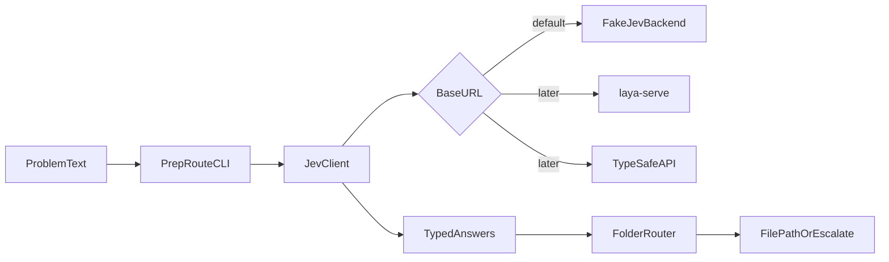

# PrepRoute: Interview Problem Triage CLI

## End product

A runnable Java CLI under [`PrepRoute/`](PrepRoute/):

```bash
cd PrepRoute && ./mvnw -q exec:java -Dexec.args="Given an array and k, return the k most frequent..."
```

Prints a routed file path (or escalates on low confidence). Backend is swappable via env: fake (default) → local Laya → TypeSafe/OpenRouter later.

## Architecture



Decision defaults (locked for this build):
- **Build:** small Maven module (repo has no `pom.xml` today; plain `.class` files won't scale for HTTP + JSON).
- **Java 17+**, JDK `HttpClient`, Jackson for request/response records.
- **No Spring** — keep the learning surface on System One, not the framework.
- **Phase 1 backend:** in-process `FakeJevBackend` that returns deterministic answers from keyword heuristics (e.g. "k most frequent" → `heap`). Same `JevRequest`/`JevResponse` types as a real call.
- **Phase 1 UX:** CLI only (no UI).

## What to build

### 1. Maven skeleton — [`PrepRoute/`](PrepRoute/)

- `pom.xml`: Java 17, Jackson, Maven exec plugin
- Package: `prep.route`
- README: how to run, env vars, example paste

### 2. Jev wire types

| Type | Responsibility |
|------|----------------|
| `Question` | Factories: `noul`, `choice`, `score` |
| `JevRequest` | `state`, `model`, `questions` |
| `JevResponse` / `Answer` | `noul`, `choice`, `score`, `confidence`, `probabilities` |

Three questions every call:
- `pattern` (choice) — options aligned to repo folders: `sliding_window`, `two_pointers`, `heap`, `graph`, `bfs_dfs`, `binary_search`, `tree`, `intervals`, `linked_list`, `other`
- `is_amazon_style` (noul)
- `interview_pressure` (score) — levels: warmup / standard / brutal

### 3. Client + backends

- `JevClient`: POST `{baseUrl}/v1/systemone`, Bearer optional
- `FakeJevBackend`: no network; implements the same evaluate method (or a local HTTP stub on `localhost` if you prefer one code path). Keyword rules good enough for demos (Top-K → heap + high Amazon noul).
- Config from env:
  - `JEV_BASE_URL` empty/`fake` → fake
  - else HTTP (future Laya `http://localhost:8000` or TypeSafe)
  - `JEV_API_KEY`, `JEV_MODEL` (default `jev-latest`)

### 4. Folder router — the product logic

[`FolderRouter`](PrepRoute/src/main/java/prep/route/FolderRouter.java) owns thresholds (not the model):

| Rule | Behavior |
|------|----------|
| `pattern.confidence < 0.70` | Escalate: print candidates, do not pick one file |
| `is_amazon_style >= 0.75` and Amazon folder has a match | Prefer `CompanyPrep/Amazon/` |
| else | Prefer pattern folder (`Heap/`, `SlidingWindow/`, …) |
| `interview_pressure >= 1.7` | Also suggest a warmer-up sibling |

Static map (seeded from this repo):

- `heap` → `Heap/TopKFrequentElement.java`, Amazon twin `CompanyPrep/Amazon/TopKFrequentElements.java`
- `sliding_window` → e.g. `SlidingWindow/LongestSubStringWithoutRepeating.java`
- `graph` → `Graphs/NetworkDelayTime.java` / Amazon equivalents
- …one default file per pattern (expand later by scanning `.java` names)

### 5. CLI entrypoint

`PrepRouteMain`:
1. Read problem text from args or stdin
2. Call client with fixed question set
3. Apply `FolderRouter`
4. Print the exact success / escalate format from the example we agreed on

### 6. Tests (no API credits)

- Unit test FakeJevBackend: Top-K text → `heap`, high amazon noul
- Unit test FolderRouter: high confidence → path; low confidence → escalate
- Optional: client serialization smoke test (Jackson round-trip)

### 7. Docs

Short README section: problem statement, how to run fake, how to point at `laya-serve` later (`JEV_BASE_URL=http://localhost:8000`), how to swap to TypeSafe when waitlist clears.

## Out of scope (later)

- Scanning all `.java` files for smarter nearest-neighbor matching
- Spring Boot / web UI
- Fine-tuning Laya
- Live TypeSafe calls (config ready only)

## Implementation order

1. Maven + records + FakeJevBackend
2. FolderRouter + CLI print path
3. HTTP JevClient behind env switch
4. Tests + README
5. Manual demo: Top-K paste → `CompanyPrep/Amazon/TopKFrequentElements.java`
